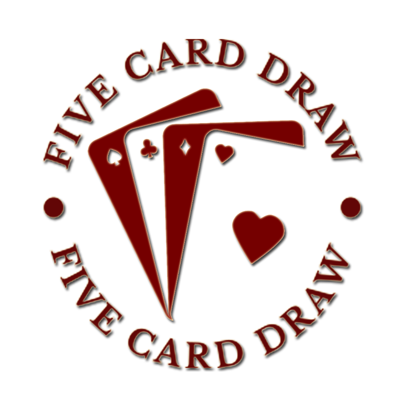

<a name="readme-top"></a>

<!-- VideoPoker-5CardRedraw -->
[![Contributors][contributors-shield]][contributors-url]
[![Forks][forks-shield]][forks-url]
[![Stargazers][stars-shield]][stars-url]
[![Issues][issues-shield]][issues-url]
[![MIT License][license-shield]][license-url]
[![LinkedIn][linkedin-shield]][linkedin-url]


<!-- PROJECT LOGO -->
<br />
<div align="center">
  <a href="https://github.com/ralbee1/VideoPoker-5CardRedraw">
    
  </a>

<h3 align="center">VideoPoker-5CardRedraw</h3>

  <p align="center">
    A pythonic creation of a 5 card redraw video poker.
    <br />
    <a href="https://github.com/ralbee1/VideoPoker-5CardRedraw"><strong>Explore the docs »</strong></a>
    <br />
    <br />
    <a href="https://github.com/ralbee1/VideoPoker-5CardRedraw">View Demo</a>
    ·
    <a href="https://github.com/ralbee1/VideoPoker-5CardRedraw/issues">Report Bug</a>
    ·
    <a href="https://github.com/ralbee1/VideoPoker-5CardRedraw/issues">Request Feature</a>
  </p>
</div>


<!-- TABLE OF CONTENTS -->
<details>
  <summary>Table of Contents</summary>
  <ol>
    <li>
      <a href="#about-the-project">About The Project</a>
      <ul>
        <li><a href="#built-with">Built With</a></li>
        <li><a href="#Features">Features</a></li>
      </ul>
    </li>
    <li>
      <a href="#getting-started">Getting Started</a>
      <ul>
        <li><a href="#prerequisites">Prerequisites</a></li>
        <li><a href="#installation">Installation</a></li>
      </ul>
    </li>
    <li><a href="#usage">Usage</a></li>
    <li><a href="#roadmap">Roadmap</a></li>
    <li><a href="#contributing">Contributing</a></li>
    <li><a href="#license">License</a></li>
    <li><a href="#contact">Contact</a></li>
    <li><a href="#acknowledgments">Acknowledgments</a></li>
  </ol>
</details>


<!-- ABOUT THE PROJECT -->
## About The Project
<!-- 
[![Product Name Screen Shot][product-screenshot]](https://example.com)
-->
VideoPoker-5CardRedraw designed as a 5 card redraw variant of video poker. This project was the first thing I ever did in Python as a learning experiment. Along the way I learned about creating graphical user interfaces in python and pythonic best practices.

<p align="right">(<a href="#readme-top">back to top</a>)</p>


### Built With

* [![Python][python.org]][python-url]
* [![PyPi][pypi.org]][pypi-url] PyPi

### Features

- [ ] **5 Card Redraw**
  - [ ] Playable GUI interface
  - [ ] Dynamic Hand Ranking and Scoring
  - [ ] Bank text file
- [ ] **PyPi Installs**

If you would like to learn more about these features, documentation is [here](https://github.com/ralbee1/VideoPoker-5CardRedraw).

<p align="right">(<a href="#readme-top">back to top</a>)</p>


<!-- GETTING STARTED -->
## Getting Started

This is an guide for running 5 card redraw poker locally.

### Prerequisites

1. [Python 3.10.8](https://www.python.org/downloads/release/python-3108/)

### Installation

**Developer Install:**
Summary: The developer install is for those who want to contribute to or clone VideoPoker-5CardRedraw.
1. Clone the repo (or use Github Desktop)
   ```sh
   git clone https://github.com/ralbee1/VideoPoker-5CardRedraw.git
   ```
2. Open the CLI and navigate the current working directory to where you cloned VideoPoker-5CardRedraw
3. Install the Pip Package from the CLI, copy and run this command:
   ```sh
   py -m pip install -e .
   ```


**User Install**
<br />
1. Automatic User Install from the Command line via PyPi.
   ```js
   pip install VideoPoker-5CardRedraw;
   ```

<p align="right">(<a href="#readme-top">back to top</a>)</p>

<!-- USAGE EXAMPLES -->
## Usage
<br />
From the command line, run
  ```js
  video_poker.py;
  ```
<p align="right">(<a href="#readme-top">back to top</a>)</p>


<!-- ROADMAP -->
## Roadmap
1. Test edge cases and pylint code.
2. Push branch to PyPi
3. (Optional) Utilize Flask and bootstrap to host this website in AWS.
4. Publish and post to my projects page.


See the [open issues](https://github.com/ralbee1/VideoPoker-5CardRedraw/issues) for a full list of proposed features (and known issues).

<p align="right">(<a href="#readme-top">back to top</a>)</p>


<!-- CONTRIBUTING -->
## Contributing

Contributions are what make the open source community such an amazing place to learn, inspire, and create. Any contributions you make are absolutely welcome!

1. Fork the Project
2. Create your Feature Branch (`git checkout -b feature/AmazingFeature`)
3. Commit your Changes (`git commit -m 'Add some AmazingFeature'`)
4. Push to the Branch (`git push origin feature/AmazingFeature`)
5. Open a Pull Request

<p align="right">(<a href="#readme-top">back to top</a>)</p>

<!-- LICENSE -->
## License

Distributed under the MIT License. See `LICENSE.txt` for more information.
<p align="right">(<a href="#readme-top">back to top</a>)</p>

<!-- CONTACT -->
## Contact

* []()Email - ralbee1@iwu.edu
* []()Project Link: [https://github.com/ralbee1/VideoPoker-5CardRedraw](https://github.com/ralbee1/VideoPoker-5CardRedraw)


<!-- ACKNOWLEDGMENTS -->
## Acknowledgments

* []() This variant of poker was inspired by Super Double Double as found in Las Vegas Casinos.

<p align="right">(<a href="#readme-top">back to top</a>)</p>


<!-- MARKDOWN LINKS & IMAGES -->
<!-- https://www.markdownguide.org/basic-syntax/#reference-style-links -->
[contributors-shield]: https://img.shields.io/github/contributors/ralbee1/VideoPoker-5CardRedraw.svg?style=for-the-badge
[contributors-url]: https://github.com/ralbee1/VideoPoker-5CardRedraw/graphs/contributors
[forks-shield]: https://img.shields.io/github/forks/ralbee1/VideoPoker-5CardRedraw.svg?style=for-the-badge
[forks-url]: https://github.com/ralbee1/VideoPoker-5CardRedraw/network/members
[stars-shield]: https://img.shields.io/github/stars/ralbee1/VideoPoker-5CardRedraw.svg?style=for-the-badge
[stars-url]: https://github.com/ralbee1/VideoPoker-5CardRedraw/stargazers
[issues-shield]: https://img.shields.io/github/issues/ralbee1/VideoPoker-5CardRedraw.svg?style=for-the-badge
[issues-url]: https://github.com/ralbee1/VideoPoker-5CardRedraw/issues
[license-shield]: https://img.shields.io/github/license/ralbee1/VideoPoker-5CardRedraw.svg?style=for-the-badge
[license-url]: https://github.com/ralbee1/VideoPoker-5CardRedraw/blob/master/LICENSE.txt
[linkedin-shield]: https://img.shields.io/badge/-LinkedIn-black.svg?style=for-the-badge&logo=linkedin&colorB=555
[linkedin-url]: https://linkedin.com/in/Richard-Albee
[product-screenshot]: images/screenshot.png
[python.org]: https://www.python.org/static/img/python-logo.png
[python-url]: https://www.python.org/
[pypi.org]: https://pypi.org/static/images/logo-small.2a411bc6.svg
[pypi-url]: https://pypi.org/project/pip/
